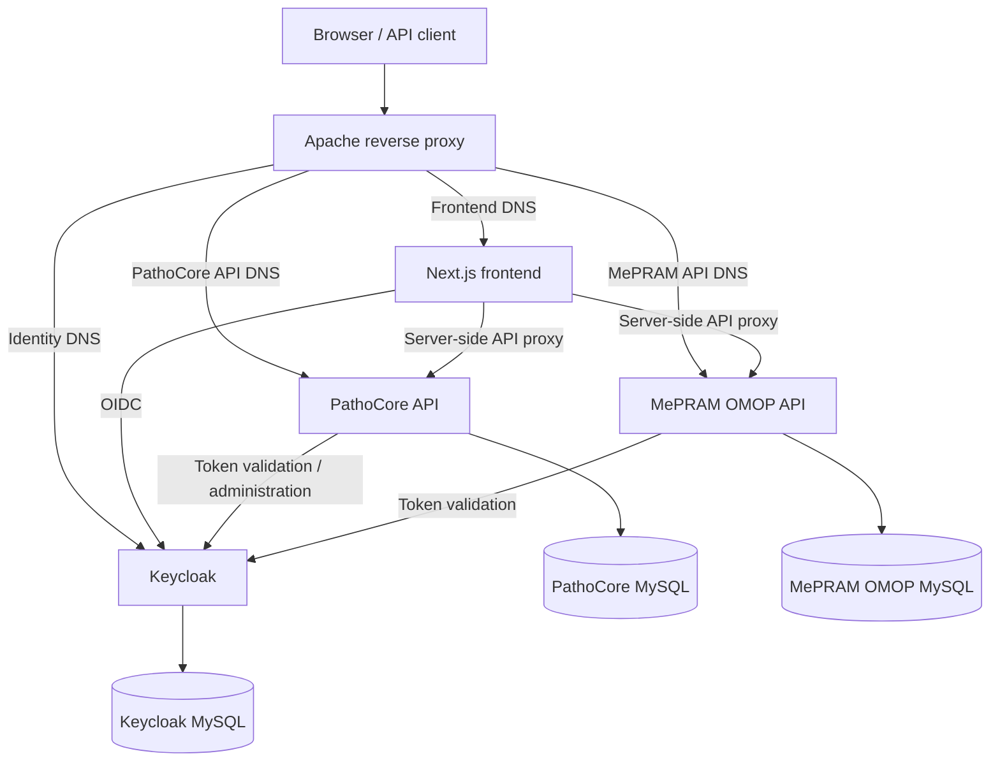

# PathoCore Web

PathoCore Web is the user-facing portal and production deployment orchestrator
for pathogen data workflows. A Next.js application presents the interface and
authentication flow, PathoCore API manages the core application data, and the
MePRAM OMOP API exposes the OMOP-backed use-case data. Apache publishes four
separate DNS endpoints, while Keycloak provides their shared identity service.
The two application databases and the Keycloak database are independent,
persistent MySQL services.



- [Get the code (required)](#get-the-code-required)
- [Choose your path](#choose-your-path)
- [Minimum requirements](#minimum-requirements)
- [Docker deployment](#docker-deployment)
  - [Local test stack](#local-test-stack)
  - [Production container](#production-container)
  - [Manage containers after installation](#manage-containers-after-installation)
  - [Upgrade docker deployment](#upgrade-docker-deployment)
- [Bare-metal deployment (Ubuntu/CentOS)](#bare-metal-deployment-ubuntucentos)
- [Common operations (Docker + bare-metal)](#common-operations-docker--bare-metal)
- [Final configuration steps](#final-configuration-steps)
- [Developer notes](#developer-notes)
- [Application documentation](#application-documentation)

## Get the code (required)

```bash
git clone https://github.com/BIPLAT-CIBERINFEC/pathocore-web.git pathocore-web
cd pathocore-web
```

For an orchestrated deployment, every external build context in the service
table must exist at the declared path relative to this checkout.

## Choose your path

| Capability | Supported | Owner or command |
|---|---:|---|
| Docker local test | Yes | `container_install.sh --test --engine docker` |
| Podman local test | Yes | `container_install.sh --test --engine podman` |
| Docker production | Yes | `container_install.sh --engine docker` |
| Podman production | Yes | `container_install.sh --engine podman` |
| Bare metal | Profile-specific | See [Bare-metal deployment](#bare-metal-deployment-ubuntucentos) |
| Upgrade | Yes | `--action upgrade` |
| Permission repair | Yes | `--action fix-permissions` |
| Backup and restore | Yes | Operator-owned; follow [LEAME.md](LEAME.md) |

Services:

| Service | Profile | Build context | Internal port |
|---|---|---|---:|
| `pathocore_web` | `nextjs` | `.` | settings: `APP_PORT` |
| `pathocore_api` | `django` | `../pathocore-api` | settings: `APP_PORT` |
| `mepram_omop_api` | `django` | `../mepram-omop-api` | settings: `APP_PORT` |

- Next.js services embed public `NEXT_PUBLIC_*` configuration at build time and run an unprivileged Node server for server rendering, middleware, route handlers, and authentication.
- Django services build with an ephemeral settings secret, render protected host settings, and run controlled migration/bootstrap steps.

Selected add-ons:

- Apache source configuration lives under `conf/apache/`; customize its virtual hosts and routes there. The installer renders final bind sources under `deployment/apache/`.
- Keycloak provides centralized identity with a health-checked MySQL service, realm import, and persistent database state.

## Minimum requirements

- Git and access to every declared build context.
- Docker Engine with Compose v2, or Podman with a Compose provider.
- Enough disk and memory for image builds and persistent application data.
- A protected production settings file for every application and selected add-on.
- Production DNS, TLS termination, database, storage, email, identity, backup,
  and monitoring services required by the selected profiles.

Copy each application's settings and each `conf/<addon>/*_production_settings.txt`
to protected ignored files, set mode `0600`, and replace every `CHANGE_ME`. The exact
meaning and security classification of settings is in
[`conf/INSTALL_SETTINGS.md`](conf/INSTALL_SETTINGS.md).

Create the ignored deployment settings directory and copy every production
template that this topology consumes:

```bash
install -d -m 0700 deployment/settings
install -m 0600 conf/docker_production_settings.txt deployment/settings/pathocore_web_production_settings.txt
install -m 0600 ../pathocore-api/conf/docker_production_settings.txt deployment/settings/pathocore_api_production_settings.txt
install -m 0600 ../mepram-omop-api/conf/docker_production_settings.txt deployment/settings/mepram_omop_api_production_settings.txt
install -m 0600 conf/apache/apache_production_settings.txt deployment/settings/apache_production_settings.txt
install -m 0600 conf/keycloak/keycloak_production_settings.txt deployment/settings/keycloak_production_settings.txt
```

Edit only the copies under `deployment/settings/`, replace every `CHANGE_ME`,
and keep their mode at `0600`. Both installation workflows below point to
these protected copies.

## Docker deployment

Both engines use the same lifecycle and Compose files. Do not invoke Compose
directly for the first install or an upgrade: the installer also renders
configuration, prepares permissions, waits for readiness, and runs bootstrap.

### Local test stack

Docker:

```bash
bash container_install.sh --test --action install --engine docker \
  --git_revision current
```

Podman:

```bash
bash container_install.sh --test --action install --engine podman \
  --git_revision current
```

Test settings and test services are disposable. Verify either deployment with:

```bash
bash scripts/smoke_test.sh --test --engine docker
# or: bash scripts/smoke_test.sh --test --engine podman
```

Django test installation creates the disposable database declared by the test
Compose profile, waits for it, applies committed migrations, optionally loads
fixtures, runs selected data scripts, collects static files, and performs the
generated health checks.

Migration/data scripts are repeatable `django-extensions` runscript names. Use
`--script_before` for preparation before migrations and `--script` (an alias of
`--script_after`) for a transformation after migrations:

```bash
bash container_install.sh --test --action install --engine docker \
  --script_before prepare_test_data \
  --script migrate_optional_values
```

Fresh installs automatically load `conf/first_install_tables.json` when the
application provides it. Use `--skip_tables` for an exceptional fresh install
without that fixture, or `--tables` to load it explicitly during an upgrade.

`--demo_data_map <service,path>`, `--skip_demo_data`, `--skip_test_data`, and
`--skip_test_data_service <service>` are part of the standard interface.
`--demo_data <path>` remains a single-service compatibility option. A project
that supplies fixtures or demo files must set
`application_supports_test_data=true` and implement `load_test_deployment_data`
in its wrapper; otherwise explicit demo data is rejected. Production never
selects or loads demo data by default, and upgrades never reload it.

For an automatic first administrator, set `CREATE_INITIAL_SUPERUSER=true` and
the `DJANGO_SUPERUSER_*` values in the selected test settings before install.
An existing account is never reset. Open the loopback URL using `APP_PORT` from
the rendered test environment, or `APACHE_PORT` when the Apache add-on is used.

### Production container

Prepare the protected settings files and deploy a reviewed tag or commit.

Docker:

```bash
bash container_install.sh --action install --engine docker \
  --git_revision <reviewed-tag-or-commit> \
  --install_conf_map pathocore_web,deployment/settings/pathocore_web_production_settings.txt --install_conf_map pathocore_api,deployment/settings/pathocore_api_production_settings.txt --install_conf_map mepram_omop_api,deployment/settings/mepram_omop_api_production_settings.txt --install_conf_map apache,deployment/settings/apache_production_settings.txt --install_conf_map keycloak,deployment/settings/keycloak_production_settings.txt
```

Podman:

```bash
bash container_install.sh --action install --engine podman \
  --git_revision <reviewed-tag-or-commit> \
  --install_conf_map pathocore_web,deployment/settings/pathocore_web_production_settings.txt --install_conf_map pathocore_api,deployment/settings/pathocore_api_production_settings.txt --install_conf_map mepram_omop_api,deployment/settings/mepram_omop_api_production_settings.txt --install_conf_map apache,deployment/settings/apache_production_settings.txt --install_conf_map keycloak,deployment/settings/keycloak_production_settings.txt
```

The installer creates `.env.production.file` for later direct Compose
operations. It contains generated runtime values, including secrets copied
from the protected settings sources, so keep it mode `0600`, excluded from Git,
and inside the protected configuration backup. Neither the protected settings
nor this generated environment file is copied into image layers.

#### Persist logs/documents on the host

| Asset | Production location | Backup/rebuild policy |
|---|---|---|
| `pathocore_web` Next.js image | Immutable container image | Rebuild from recorded revision |
| `pathocore_api` database | `pathocore_api_db_data` named volume, mounted by `pathocore_api_db` | Logical dump before migration; volume is persistent state |
| `pathocore_api` documents | `pathocore_api_documents` named volume | Volume backup |
| `pathocore_api` static | `pathocore_api_static` named volume | Replaceable through collectstatic |
| `pathocore_api` logs | Host bind configured by `HOST_LOG_PATH` in `pathocore_api_production_settings.txt` | Retain/rotate per institutional log policy |
| `pathocore_api` rendered settings | Host bind configured by `DJANGO_SETTINGS_PATH` in `pathocore_api_production_settings.txt` | Protected configuration backup |
| `mepram_omop_api` database | `mepram_omop_api_db_data` named volume, mounted by `mepram_omop_api_db` | Logical dump before migration; volume is persistent state |
| `mepram_omop_api` documents | `mepram_omop_api_documents` named volume | Volume backup |
| `mepram_omop_api` static | `mepram_omop_api_static` named volume | Replaceable through collectstatic |
| `mepram_omop_api` logs | Host bind configured by `HOST_LOG_PATH` in `mepram_omop_api_production_settings.txt` | Retain/rotate per institutional log policy |
| `mepram_omop_api` rendered settings | Host bind configured by `DJANGO_SETTINGS_PATH` in `mepram_omop_api_production_settings.txt` | Protected configuration backup |
| Apache logs | `/var/log/local/pathocore-web/apache` host bind | Retain/rotate per institutional log policy |
| Rendered Apache configuration | `deployment/apache/` in the deployment checkout | Rebuildable; preserve reviewed source configuration |
| Keycloak database | `keycloak_db_data` MySQL named volume | Database and identity backup |
| Keycloak staged realm | `/srv/containers/bind/pathocore-web/keycloak/realm-import/` read-only host bind | Back up with deployment configuration; reproducible bootstrap input, not authoritative identity state |

The standard fixes application binds below `/srv/containers/bind/pathocore-web`
and logs below `/var/log/local/pathocore-web`. The operator must still record the
backup owner, retention, actual engine volume names, and restore-test evidence
for every non-rebuildable asset. Never treat a container writable layer as
persistent storage.

#### Reverse proxy and application server

The selected profiles and add-ons define the internal application server and
proxy topology. Review public hostnames, TLS ownership, forwarded headers,
request limits, timeouts, health paths, and static/media routing together.

#### Scheduled jobs

The application developer must list every scheduler/worker, whether a failed
job blocks a workflow, and how operators inspect and retry it. Do not add an
untracked host cron job when the application profile owns scheduling.

### Manage containers after installation

Use the engine that performed the installation:

```bash
docker compose --env-file .env.production.file -f docker-compose.prod.yml ps
docker compose --env-file .env.production.file -f docker-compose.prod.yml logs --tail 200
docker compose --env-file .env.production.file -f docker-compose.prod.yml restart
```

```bash
podman compose --env-file .env.production.file -f docker-compose.prod.yml ps
podman compose --env-file .env.production.file -f docker-compose.prod.yml logs --tail 200
podman compose --env-file .env.production.file -f docker-compose.prod.yml restart
```

### Upgrade docker deployment

After taking a consistent backup and reading the version-specific upgrade
notes:

```bash
bash container_install.sh --action upgrade --engine podman \
  --git_revision <new-reviewed-tag-or-commit> \
  --install_conf_map pathocore_web,deployment/settings/pathocore_web_production_settings.txt --install_conf_map pathocore_api,deployment/settings/pathocore_api_production_settings.txt --install_conf_map mepram_omop_api,deployment/settings/mepram_omop_api_production_settings.txt --install_conf_map apache,deployment/settings/apache_production_settings.txt --install_conf_map keycloak,deployment/settings/keycloak_production_settings.txt
```

Replace `podman` with `docker` for a Docker-managed deployment. Stop on build,
readiness, bootstrap, migration, or smoke-test failure. See [LEAME.md](LEAME.md)
for the ordered production checklist and rollback decision.

## Bare-metal deployment (Ubuntu/CentOS)

### Install

#### Clone the repository

Use [Get the code (required)](#get-the-code-required) and check out the reviewed
revision.

#### Prepare the database

Provision the application database and least-privilege account outside the
installer. Confirm that the host can reach it before bootstrap.

#### Configure install_settings.txt

Start from `conf/docker_production_settings.txt`, but review all paths and
container-oriented defaults for the target host. Keep the resulting file
ignored and mode `0600`.

#### Run install.sh

The Next.js profile does not generate a bare-metal installer. Deploy the
immutable Node.js container, or define and test a separate build, atomic
release, rollback, process supervision, and service-management procedure.

The Django profile includes `install.sh` for application staging and bootstrap,
but system package, database, web-server, service-manager, TLS, and backup
provisioning remain host-specific. Bare-metal installation is supported only
after the application developer documents and tests those integrations.

```bash
# Stage application files and dependencies.
bash install.sh --stage install --git_revision current \
  --conf deployment/settings/pathocore_web_production_settings.txt

# Bootstrap the prepared runtime (settings, migrations and static files).
bash install.sh --bootstrap install \
  --conf deployment/settings/pathocore_web_production_settings.txt
```

For upgrades, take a backup and replace both `install` actions with `upgrade`.
Do not use container-oriented paths or defaults on a bare-metal host without an
application-specific review.

For a host-managed Apache 2.4 deployment, adapt the reviewed virtual host from
`conf/apache/` to the distribution path. The generated add-on files target the
container image, so do not copy them blindly without checking module names,
paths, runtime user, TLS ownership, and log locations.

Ubuntu/Debian baseline:

```bash
sudo cp <reviewed-apache-vhost.conf> /etc/apache2/sites-available/pathocore-web.conf
sudo a2enmod proxy proxy_http headers
sudo a2ensite pathocore-web.conf
sudo apache2ctl configtest
sudo systemctl reload apache2
```

CentOS/RHEL baseline:

```bash
sudo cp <reviewed-apache-vhost.conf> /etc/httpd/conf.d/pathocore-web.conf
sudo httpd -t
sudo systemctl reload httpd
```

The reviewed virtual host must define the public `ServerName`, proxy to the
Django `APP_PORT`, serve the correct static/media paths, preserve forwarded
scheme/host headers, and use institutionally managed TLS and logs.

### Upgrade bare-metal deployment

Follow the same staged lifecycle with `upgrade` only after a consistent backup
and review of the version-specific guide.

## Common operations (Docker + bare-metal)

### Database creation, users and grants

Production runs one private MySQL service per API. Configure the protected
settings with distinct database names, application users, and application
passwords. The database hosts and ports are fixed by the Compose network:

```bash
DB_HOST='pathocore_api_db'       # PathoCore API settings
DB_HOST='mepram_omop_api_db'    # MePRAM OMOP API settings
DB_PORT='3306'
DB_NAME='CHANGE_ME'
DB_USER='CHANGE_ME'
DB_PASSWORD='CHANGE_ME'
```

MySQL initializes each empty named volume from those values. Changing them
later does not rewrite accounts in an existing database. The two application
database containers generate random root passwords because root access is not
part of either API's production contract. Verify connectivity through each API
database container rather than publishing database ports publicly:

```bash
podman compose --env-file .env.production.file -f docker-compose.prod.yml \
  exec -T pathocore_api_db sh -c \
  'mysql -u"$MYSQL_USER" -p"$MYSQL_PASSWORD" "$MYSQL_DATABASE" -e "SELECT 1"'
podman compose --env-file .env.production.file -f docker-compose.prod.yml \
  exec -T mepram_omop_api_db sh -c \
  'mysql -u"$MYSQL_USER" -p"$MYSQL_PASSWORD" "$MYSQL_DATABASE" -e "SELECT 1"'
```

### Backups

Back up every non-rebuildable row in the persistence table from one consistent
recovery point before installation or upgrade. Record the revision, image IDs,
settings files, and backup identifiers.

```bash
BACKUP_DIR="/srv/containers/backup/pathocore-web/$(date +%Y%m%d_%H%M%S)"
DOCUMENTS_VOLUME='CHANGE_ME'
mkdir -p "$BACKUP_DIR"
git rev-parse HEAD > "$BACKUP_DIR/git-revision.txt"
cp .env.production.file "$BACKUP_DIR/"
cp deployment/settings/pathocore_web_production_settings.txt "$BACKUP_DIR/"
cp deployment/settings/pathocore_api_production_settings.txt "$BACKUP_DIR/"
cp deployment/settings/mepram_omop_api_production_settings.txt "$BACKUP_DIR/"
cp deployment/settings/apache_production_settings.txt "$BACKUP_DIR/"
cp deployment/settings/keycloak_production_settings.txt "$BACKUP_DIR/"
chmod -R go-rwx "$BACKUP_DIR"

podman compose --env-file .env.production.file -f docker-compose.prod.yml \
  exec -T pathocore_api_db sh -c \
  'exec mysqldump --single-transaction --routines --triggers -u"$MYSQL_USER" -p"$MYSQL_PASSWORD" "$MYSQL_DATABASE"' \
  > "$BACKUP_DIR/pathocore-api-database.sql"
podman compose --env-file .env.production.file -f docker-compose.prod.yml \
  exec -T mepram_omop_api_db sh -c \
  'exec mysqldump --single-transaction --routines --triggers -u"$MYSQL_USER" -p"$MYSQL_PASSWORD" "$MYSQL_DATABASE"' \
  > "$BACKUP_DIR/mepram-omop-api-database.sql"

podman volume ls | grep 'pathocore-web'
podman volume export "$DOCUMENTS_VOLUME" > "$BACKUP_DIR/documents.tar"
# Dump logico obligatorio del estado autoritativo de Keycloak.
podman compose --env-file .env.production.file -f docker-compose.prod.yml \
  exec -T pathocore-web-keycloak-db sh -c \
  'exec mysqldump --single-transaction --routines --triggers -u"$MYSQL_USER" -p"$MYSQL_PASSWORD" "$MYSQL_DATABASE"' \
  > "$BACKUP_DIR/keycloak-database.sql"
tar -C /srv/containers/bind -czf "$BACKUP_DIR/bind-mounts.tar.gz" pathocore-web
sha256sum "$BACKUP_DIR"/* > "$BACKUP_DIR/SHA256SUMS"
```

For Docker, archive a named volume through a temporary container after ensuring
the application is not writing to it:

```bash
docker run --rm \
  --volume "$DOCUMENTS_VOLUME":/data:ro \
  --volume "$BACKUP_DIR":/backup \
  alpine tar -C /data -cf /backup/documents.tar .
```

The full ordered backup checklist, including logs and image metadata, is in
[LEAME.md](LEAME.md).

### Restore / rollback

An image-only rollback is safe only when the previous application version
supports the current schema and persistent-file format. Otherwise stop writes,
restore the database and files from the same recovery point, deploy the recorded
compatible revision, and rerun all smoke tests.

Compatible application-only rollback:

```bash
bash container_install.sh --action upgrade --engine podman \
  --git_revision <previous-reviewed-revision> \
  --install_conf_map pathocore_web,deployment/settings/pathocore_web_production_settings.txt --install_conf_map pathocore_api,deployment/settings/pathocore_api_production_settings.txt --install_conf_map mepram_omop_api,deployment/settings/mepram_omop_api_production_settings.txt --install_conf_map apache,deployment/settings/apache_production_settings.txt --install_conf_map keycloak,deployment/settings/keycloak_production_settings.txt
```

Full restore when schema or persistent-file formats are incompatible:

```bash
BACKUP_DIR='/srv/containers/backup/pathocore-web/CHANGE_ME'
DOCUMENTS_VOLUME='CHANGE_ME'
podman compose --env-file .env.production.file -f docker-compose.prod.yml down
podman volume import "$DOCUMENTS_VOLUME" "$BACKUP_DIR/documents.tar"
tar -C /srv/containers/bind -xzf "$BACKUP_DIR/bind-mounts.tar.gz"
install -d -m 0700 deployment/settings
install -m 0600 "$BACKUP_DIR/pathocore_web_production_settings.txt" deployment/settings/pathocore_web_production_settings.txt
install -m 0600 "$BACKUP_DIR/pathocore_api_production_settings.txt" deployment/settings/pathocore_api_production_settings.txt
install -m 0600 "$BACKUP_DIR/mepram_omop_api_production_settings.txt" deployment/settings/mepram_omop_api_production_settings.txt
install -m 0600 "$BACKUP_DIR/apache_production_settings.txt" deployment/settings/apache_production_settings.txt
install -m 0600 "$BACKUP_DIR/keycloak_production_settings.txt" deployment/settings/keycloak_production_settings.txt
bash container_install.sh --action fix-permissions --engine podman \
  --install_conf_map pathocore_web,deployment/settings/pathocore_web_production_settings.txt --install_conf_map pathocore_api,deployment/settings/pathocore_api_production_settings.txt --install_conf_map mepram_omop_api,deployment/settings/mepram_omop_api_production_settings.txt --install_conf_map apache,deployment/settings/apache_production_settings.txt --install_conf_map keycloak,deployment/settings/keycloak_production_settings.txt
# Start only the databases and wait for all three to accept connections.
podman compose --env-file .env.production.file -f docker-compose.prod.yml \
  up -d pathocore_api_db mepram_omop_api_db keycloak_db
for service in pathocore_api_db mepram_omop_api_db; do
  until podman compose --env-file .env.production.file -f docker-compose.prod.yml \
    exec -T "$service" sh -c \
    'mysqladmin ping -h 127.0.0.1 -u"$MYSQL_USER" -p"$MYSQL_PASSWORD" --silent'; do sleep 2; done
  podman compose --env-file .env.production.file -f docker-compose.prod.yml \
    exec -T "$service" sh -c \
    'exec mysql -u"$MYSQL_USER" -p"$MYSQL_PASSWORD" -e "DROP DATABASE IF EXISTS \`$MYSQL_DATABASE\`; CREATE DATABASE \`$MYSQL_DATABASE\` CHARACTER SET utf8mb4 COLLATE utf8mb4_unicode_ci;"'
done
until podman compose --env-file .env.production.file -f docker-compose.prod.yml \
  exec -T pathocore-web-keycloak-db sh -c \
  'mysqladmin ping -h 127.0.0.1 -u"$MYSQL_USER" -p"$MYSQL_PASSWORD" --silent'; do sleep 2; done
podman compose --env-file .env.production.file -f docker-compose.prod.yml \
  exec -T pathocore-web-keycloak-db sh -c \
  'exec mysql -uroot -p"$MYSQL_ROOT_PASSWORD" -e "DROP DATABASE IF EXISTS \`$MYSQL_DATABASE\`; CREATE DATABASE \`$MYSQL_DATABASE\` CHARACTER SET utf8mb4 COLLATE utf8mb4_unicode_ci;"'
podman compose --env-file .env.production.file -f docker-compose.prod.yml \
  exec -T pathocore_api_db sh -c \
  'exec mysql -u"$MYSQL_USER" -p"$MYSQL_PASSWORD" "$MYSQL_DATABASE"' \
  < "$BACKUP_DIR/pathocore-api-database.sql"
podman compose --env-file .env.production.file -f docker-compose.prod.yml \
  exec -T mepram_omop_api_db sh -c \
  'exec mysql -u"$MYSQL_USER" -p"$MYSQL_PASSWORD" "$MYSQL_DATABASE"' \
  < "$BACKUP_DIR/mepram-omop-api-database.sql"
podman compose --env-file .env.production.file -f docker-compose.prod.yml \
  exec -T pathocore-web-keycloak-db sh -c \
  'exec mysql -u"$MYSQL_USER" -p"$MYSQL_PASSWORD" "$MYSQL_DATABASE"' \
  < "$BACKUP_DIR/keycloak-database.sql"
```

Then deploy the revision recorded in `git-revision.txt`, start the deployment,
and run the smoke test before reopening service. For Docker volume restoration,
reverse the temporary-container archive command by mounting the empty target
volume at `/data` and extracting `/backup/documents.tar` there.

The schema recreation above is intentionally destructive and belongs only in a
declared full restore after the current state has been preserved. Normal
application-only rollback must retain the existing database volumes.

### What to do if something fails

1. Preserve installer output, `compose ps`, image IDs, and service logs.
2. Test the direct application health endpoint and dependencies.
3. Test proxy routing, public DNS, and TLS after direct health succeeds.
4. Run permission repair for reviewed ownership or SELinux drift:

   ```bash
   bash container_install.sh --action fix-permissions --engine podman \
     --install_conf_map pathocore_web,deployment/settings/pathocore_web_production_settings.txt --install_conf_map pathocore_api,deployment/settings/pathocore_api_production_settings.txt --install_conf_map mepram_omop_api,deployment/settings/mepram_omop_api_production_settings.txt --install_conf_map apache,deployment/settings/apache_production_settings.txt --install_conf_map keycloak,deployment/settings/keycloak_production_settings.txt
   ```

5. Do not fake migrations, delete volumes, or rebuild from an unrecorded
   revision as a first response.

### Service-specific operational commands

#### Django service `pathocore_api`

```bash
# Logs and an interactive shell (replace podman with docker when applicable).
podman compose --env-file .env.production.file -f docker-compose.prod.yml \
  logs --tail 200 pathocore_api
podman compose --env-file .env.production.file -f docker-compose.prod.yml \
  exec pathocore_api bash

# Rebuild static assets without running migrations.
podman compose --env-file .env.production.file -f docker-compose.prod.yml \
  exec pathocore_api bash -lc \
  'cd "$INSTALL_PATH" && source virtualenv/bin/activate && python manage.py collectstatic --noinput'

# Inspect Django and migration state before deciding whether to recover.
podman compose --env-file .env.production.file -f docker-compose.prod.yml \
  exec pathocore_api bash -lc \
  'cd "$INSTALL_PATH" && source virtualenv/bin/activate && python manage.py check --deploy && python manage.py showmigrations --plan'
```

For bootstrap recovery, fix the cause and rerun `container_install.sh` with the
same revision, protected configuration, and `--action install` or `upgrade`.
This safely recreates the temporary runtime configuration and repeats the
controlled migration/fixture/static lifecycle. Direct `manage.py migrate` is a
diagnostic last resort and must use the same backup and release procedure.

#### Django service `mepram_omop_api`

```bash
# Logs and an interactive shell (replace podman with docker when applicable).
podman compose --env-file .env.production.file -f docker-compose.prod.yml \
  logs --tail 200 mepram_omop_api
podman compose --env-file .env.production.file -f docker-compose.prod.yml \
  exec mepram_omop_api bash

# Rebuild static assets without running migrations.
podman compose --env-file .env.production.file -f docker-compose.prod.yml \
  exec mepram_omop_api bash -lc \
  'cd "$INSTALL_PATH" && source virtualenv/bin/activate && python manage.py collectstatic --noinput'

# Inspect Django and migration state before deciding whether to recover.
podman compose --env-file .env.production.file -f docker-compose.prod.yml \
  exec mepram_omop_api bash -lc \
  'cd "$INSTALL_PATH" && source virtualenv/bin/activate && python manage.py check --deploy && python manage.py showmigrations --plan'
```

For bootstrap recovery, fix the cause and rerun `container_install.sh` with the
same revision, protected configuration, and `--action install` or `upgrade`.
This safely recreates the temporary runtime configuration and repeats the
controlled migration/fixture/static lifecycle. Direct `manage.py migrate` is a
diagnostic last resort and must use the same backup and release procedure.

#### Apache service

```bash
podman compose --env-file .env.production.file -f docker-compose.prod.yml \
  logs --tail 200 pathocore-web-apache
podman compose --env-file .env.production.file -f docker-compose.prod.yml \
  exec pathocore-web-apache httpd -t

APACHE_PORT='CHANGE_ME'
SERVER_STATUS_SERVER_NAME='localhost'
curl --fail --show-error \
  --header "Host: $SERVER_STATUS_SERVER_NAME" \
  "http://127.0.0.1:$APACHE_PORT/server-status?auto"
```

Keep `SERVER_STATUS_ALLOW_FROM` limited to trusted diagnostic hosts. If SELinux
is enabled, inspect the persistent log bind and confirm a container-compatible
label before restarting:

```bash
ls -ldZ /var/log/local/pathocore-web/apache
```

An Apache failure containing `ModSecurity: Failed to open debug log file` often
means the existing `modsec_debug.log` inode has stale ownership or labeling.
Preserve it for diagnosis, run `fix-permissions`, and restart Apache. If it must
be replaced, move it to a timestamped backup instead of deleting evidence:

```bash
sudo mv /var/log/local/pathocore-web/apache/modsec_debug.log \
  /var/log/local/pathocore-web/apache/modsec_debug.log.blocked
bash container_install.sh --action fix-permissions --engine podman \
  --install_conf_map pathocore_web,deployment/settings/pathocore_web_production_settings.txt --install_conf_map pathocore_api,deployment/settings/pathocore_api_production_settings.txt --install_conf_map mepram_omop_api,deployment/settings/mepram_omop_api_production_settings.txt --install_conf_map apache,deployment/settings/apache_production_settings.txt --install_conf_map keycloak,deployment/settings/keycloak_production_settings.txt
podman compose --env-file .env.production.file -f docker-compose.prod.yml restart pathocore-web-apache
```

#### Keycloak realm bind

The installer copies repository-owned JSON from `KEYCLOAK_REALM_SOURCE_PATH`
into the deployment-owned `KEYCLOAK_IMPORT_PATH` before Compose starts. With
the generated production default, the read-only bind source is:

```text
/srv/containers/bind/pathocore-web/keycloak/realm-import/
```

Do not change permissions on the repository source. The installer creates the
staging directory when `/srv/containers/bind/pathocore-web` is writable by the
deployment user and assigns staged files to Keycloak as `1000:0` with mode
`0640`. Back up this directory with the other protected deployment binds, but
use `keycloak_db_data` as the authoritative identity backup.

## Final configuration steps

The application developer must document real post-install workflows here:
initial administrator ownership, email delivery, identity-provider clients,
storage credentials, scheduled jobs, and one representative user workflow.
The generated baseline creates the initial Django administrator only when its
profile settings explicitly request it.

## Developer notes

### Shared container installer library

`container_install.sh` sources the vendored files under
`deployment/lib/container/`. Do not edit those copies. Check or update them
from the standards repository with `scaffold.py check-lib` or `sync-lib`.

### Schema migration workflow

Django migrations MUST be generated, reviewed, tested, and committed with the
release. Installation and production upgrade run `migrate --noinput`; they
MUST NOT run `makemigrations` or silently manufacture schema history.

For a legacy application entering the standard:

1. Generate and commit baseline migrations from the last supported stable tag.
2. Generate and commit new migrations for later model changes.
3. Verify the committed migration history matches the supported production
   database before deploying it.
4. Put ordered data transformations in version-specific upgrade guides and run
   them through `--script_before`, `--script_after`, or `--script`.
5. Verify `showmigrations --plan` has no unapplied entries after bootstrap.

Never use `--fake` to conceal a failed or partially applied migration. New
installations and upgrades use the committed migration graph.

### Persistent host paths

Keep source checkouts, protected configuration, bind mounts, engine-managed
volumes, logs, and backups separate. For rootless Podman, run the installer as
the same unprivileged account every time and use `fix-permissions` instead of
manually changing engine storage.

### Verification of the installation

```bash
bash scripts/smoke_test.sh --engine podman
```

Application developers must extend the baseline smoke test with authenticated
and domain-specific read workflows without removing the generated checks.

## Application documentation

Application developers: replace this paragraph with links to user,
administrator, API, upgrade, and support documentation.
